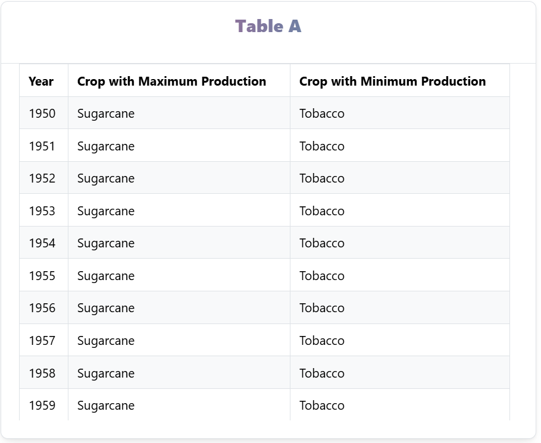
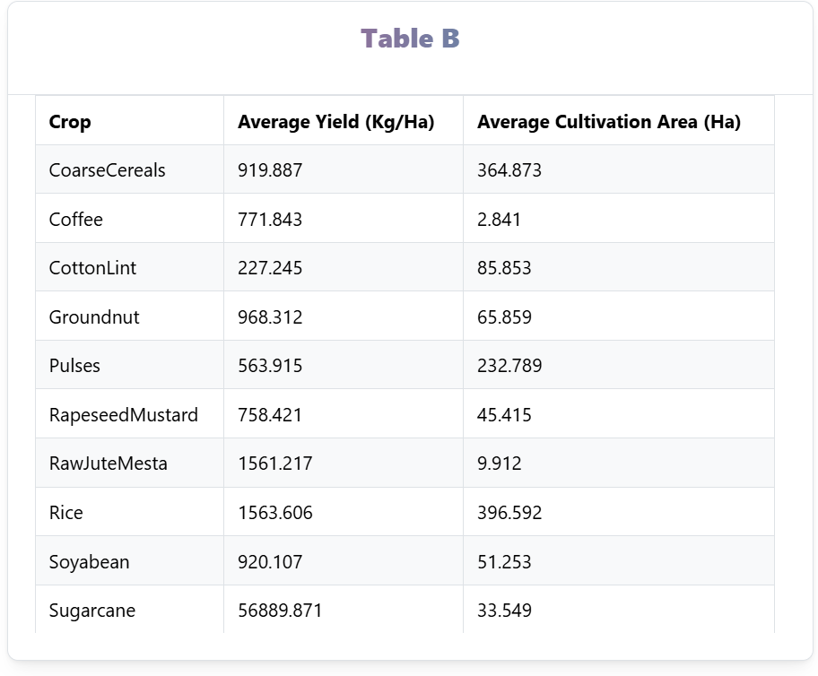

# Indian Agriculture Data Analysis

This project is designed to perform data analytics on the Indian Agriculture dataset (provided by NITI Aayog) and display the results in tables using **Mantine v7** and **TypeScript**. The project allows for aggregating crop data and displaying the results in two separate tables.

## Table of Contents

- [Installation](#installation)
- [Usage](#usage)
- [Features](#features)
- [Project Structure](#project-structure)
- [Calculations & Logic](#calculations--logic)
- [Screenshots](#screenshots)

## Installation

To get started with the project, follow the steps below:

### 1. Clone the repository

git clone [<your-repository-url>](https://github.com/PeerMohammad07/Frontend-Data-Analysis-Task.git)

cd Frontend-Data-Analysis-Task

### 2. Install dependencies

Ensure that you have Node.js installed. Then, install the necessary packages using:

yarn install

### 3. Start the application
To run the application and view it in the browser:

yarn dev

This will open the browser automatically with the desired page rendered.

# Usage

Once the app is running, it will display two tables:

Table 1: Displays the crop with maximum production and the crop with minimum production for each year from 1950 to 2020.
Table 2: Shows the average yield and average cultivation area for each crop from 1950 to 2020.
The average values are rounded to three decimal places, and missing values are treated as 0.

# Features

Aggregated crop data by year (Maximum and Minimum Production)
Aggregated crop data by crop (Average Yield and Average Cultivation Area)
Clean and responsive tables implemented using Mantine v7

# Project Structure

The project structure is as follows:

/src

  /components      # Contains the UI components (e.g., Table)
  
  /data            # Contains the data file (e.g., data.ts)
  
  /interfaces      # TypeScript interfaces for type safety (e.g., IData.ts)
  
  App.tsx          # Main application file
  
  index.tsx        # Entry point for the application
  
/package.json      # Project dependencies and scripts

/README.md         # This file

# Calculations & Logic

Table 1: Crop Production by Year
Aggregates the data based on each year and identifies the crop with maximum and minimum production for that year.

Table 2: Crop Data (Average Yield and Cultivation Area)
Calculates the average yield (kg/ha) and average cultivation area (ha) for each crop from 1950 to 2020.

Any missing values are treated as 0.
Rounding: All average values are rounded to three decimal places.

# Screenshots

### Table 1: Crop with Maximum and Minimum Production (1950-2020)

### Table 2: Average Yield and Cultivation Area (1950-2020)

